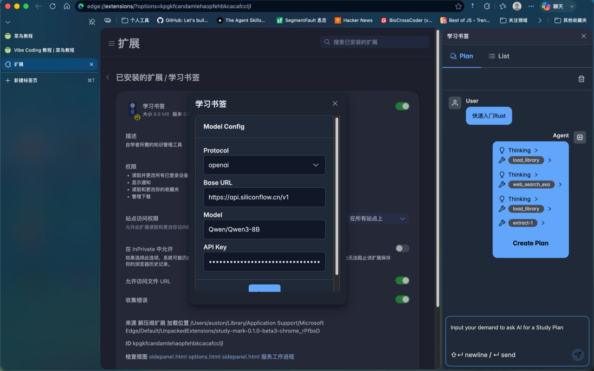
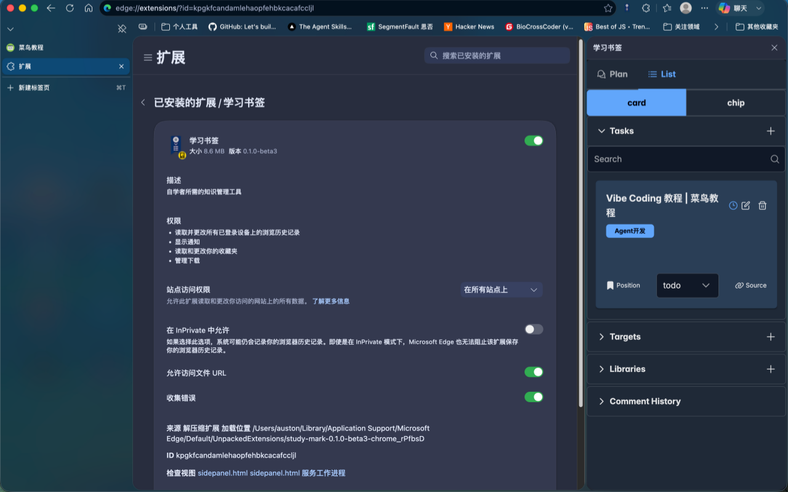
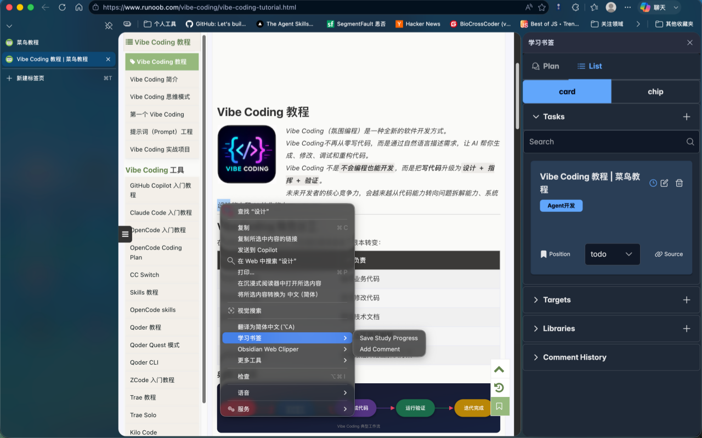
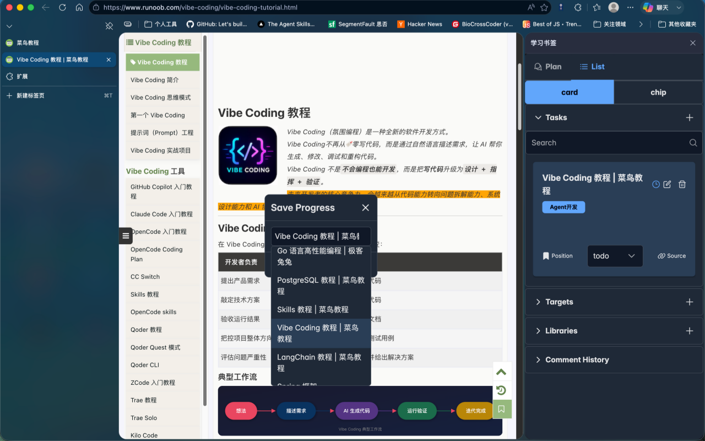
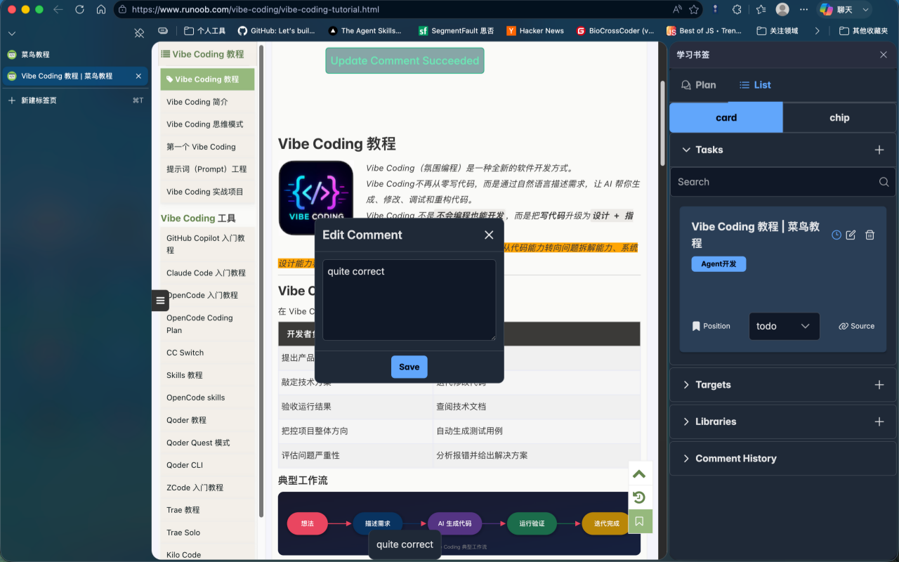

# Study Mark

English | [中文](README.zh.md)

## Introduction

***The knowledge management tools required by self-learners.***

## Features

1. Ask AI to give a study plan

2. View and edit study plans

3. Context menu options

4. Save study progress

5. Edit and View Comments on Webpage

